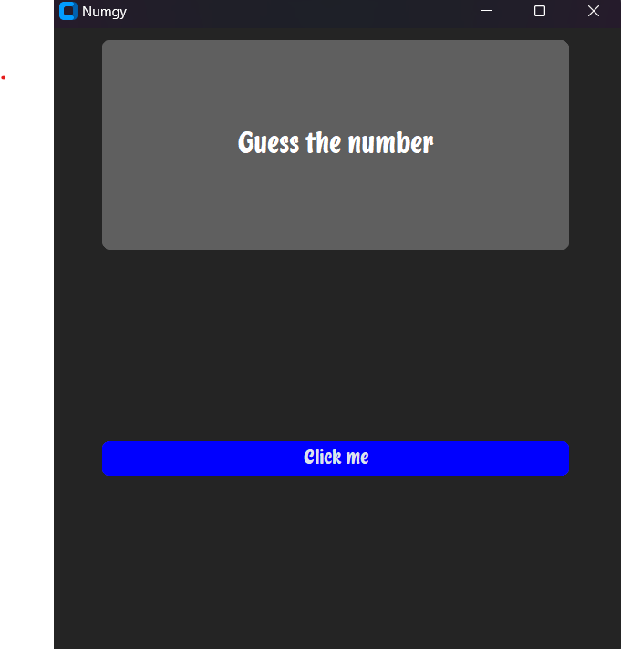
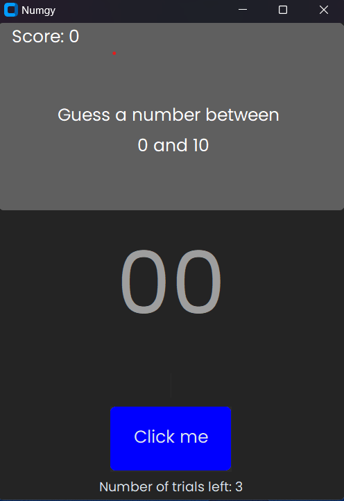

## Welcome to Numgy! 🎲

Hi, I'm Benie Gouli—and this is my very first "serious" Python project!
I'm using it to practice Git and GitHub, review core Python concepts, and dive into GUI development (I love GUIs!).

**Numgy** is a simple number guessing game built with Python. The player has to guess a random number between 1 and 100.  
It uses `customtkinter` to build a clean, modern interface (because, let’s be honest—`tkinter` is kinda outdated 😄).

## 🔧 Features
- Random number generation ✅
- User-friendly GUI with input fields and feedback labels ✅
- Retry and reset functionality 🟧
- trials left and score ✅
- give hints on the closeness to the true number ✅

## 📸 Preview

Here's what Numgy looks like for now:

Update : 25/04/2025
I tried to "improve" the look and added sections for the score, alerts and trials left

## What I have learned
- I actually understood what is super(): It means go to the next class in MRO if method/ attribute not found in the current class
- I learned how to position text with the anchor and justify attributes
- I learned how to use StringVar and textVariable
- I learned how to get the content of an entry with .get() and how to delete it with .delete()
- pack() is better that grid() if I only want to place stuff on the "same column"
- I can't use multiple geometry managers on the same master frame
- It is a better practice to separate large programes into several modules that will be imported
- I have learned how to use the validate an validatecommand attributes with the entry widget (I haven't fully mastered it though)

  

